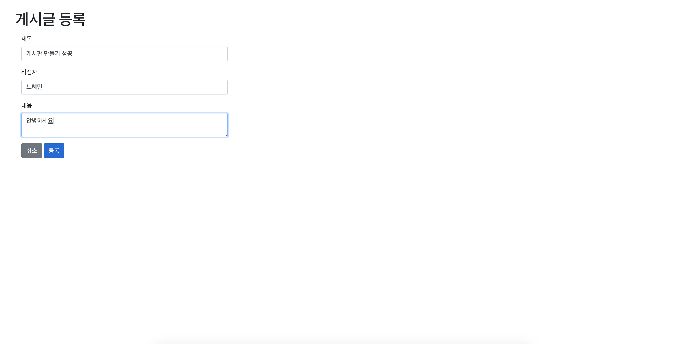

SpringBoot Study
=============

    🌱SpringBoot를 이용한 서비스 구축을 공부합니다 👩‍💻
    

## 🖥 게시판 웹   

참고 서적을 따라 게시판을 제작하며 기술적 내용을 학습하고 곧바로 응용해보는 과정을 가졌습니다.  

OAuth2.0을 활용한 구글, 네이버 로그인이 가능합니다.

(실제 배포가 이루어 지지 않았기 때문에 로컬 환경에서 실행 시,
로그인 후 사용자에게 테이블 접근 권한을 주어야 게시글 작성이 가능합니다.)

<kbd></kbd>
<kbd></kbd>

#### 참고

* 스프링 부트와 AWS로 혼자 구현하는 웹 서비스 - 이동욱
